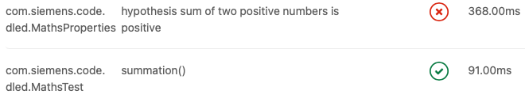
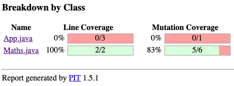
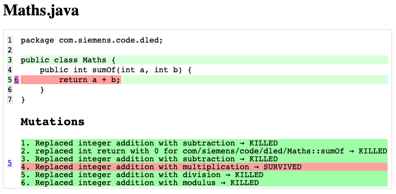
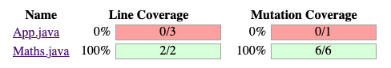
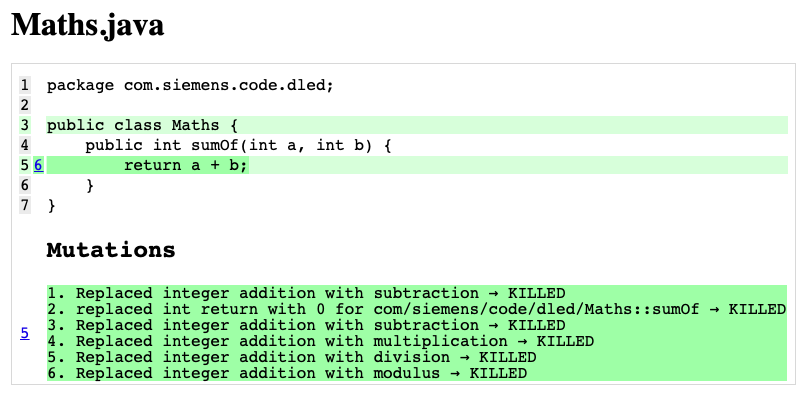

# java-testing-the-tests

> The build is broken by design in this repo

Chasing high line or even branch coverage is not the whole picture.

The quality lies in the expectations and assumptions of the people involved.

The assumptions and the explicit expectations are further verified via Property-Based Testing & Mutation Testing.

It's about **testing the tests**.

The system under test is a simple function:

```java
int sumOf(int a, int b) {
    return a + b;
}
```

and the test that would give a 100% coverage:

```java
@Test void summation() {
    // how hard can 2+2 be?
    assertThat(maths.sumOf(2, 2))
        .isEqualTo(4)
    ;
}
```

Yet in this simple example, with a 100% coverage *easily* attainable, the expected qualities may be insufficient.



[Source](app/src/test/java/com/siemens/code/dled/MathsProperties.java)

## Mutation Testing

> How hard is it to test 2+2 (addition)?

Testing the quality of test via mutation testing: https://pitest.org

```bash
gradle pitest
```

or

```bash
./gradlew pitest
```

&darr;

test `2 + 2 == 4`:

open [`app/build/reports/pitest/com.siemens.code.dled/index.html`](app/build/reports/pitest/com.siemens.code.dled/index.html)



)

the line coverage is perfect, yet mutations hint at inputs not verified: `2*2==4`

Adding one more test: `2+4=6` fills the coverage gap:

&darr;



)

comment out the second test in [MathsTest.java](app/src/test/java/com/siemens/code/dled/MathsTest.java) to see the mutation coverage drop.

## Property-Based Testing

> Are you sure, programming and eliminating bugs is that simple?

Testing the assumptions about code: https://jqwik.net

```java
boolean hypothesis_sum_of_two_positive_numbers_is_positive(
  @ForAll("positive") int a,
  @ForAll("positive") int b
) {
  return maths.sumOf(a, b) > 0;
}
```

(such assumptions [can be fatal](https://en.wikipedia.org/wiki/Integer_overflow#Examples))

&darr;

```bash
gradle test --rerun-tasks --info
```

&darr;

```text
MathsProperties > hypothesis sum of two positive numbers is positive STANDARD_OUT
    timestamp = 2021-07-07T16:36:48.104006, MathsProperties:hypothesis sum of two positive numbers is positive =
      org.opentest4j.AssertionFailedError:
        Property [MathsProperties:hypothesis sum of two positive numbers is positive] failed with sample {0=1, 1=2147483647}

                                  |-------------------jqwik-------------------
    tries = 12                    | # of calls to property
    checks = 12                   | # of not rejected calls
    generation = RANDOMIZED       | parameters are randomly generated
    after-failure = PREVIOUS_SEED | use the previous seed
    when-fixed-seed = ALLOW       | fixing the random seed is allowed
    edge-cases#mode = MIXIN       | edge cases are mixed in
    edge-cases#total = 16         | # of all combined edge cases
    edge-cases#tried = 2          | # of edge cases tried in current run
    seed = -5436190997333692374   | random seed to reproduce generated values

    Shrunk Sample (1 steps)
    -----------------------
      a: 1
      b: 2147483647

    Original Sample
    ---------------
      a: 19
      b: 2147483647


Test hypothesis sum of two positive numbers is positive(com.siemens.code.dled.MathsProperties) took 421 ms.

MathsProperties > hypothesis sum of two positive numbers is positive FAILED
```

<!--
SPDX-FileCopyrightText: © 2024 Siemens AG
SPDX-License-Identifier: Unlicense
-->
